  

 

## Core

Platform foundation. Backend, API, auth, data, storage.

| Layer | Primary | Alternatives |
|---|---|---|
| Language | TypeScript | Python · Go · Rust |
| Runtime | Node.js | Bun · Deno |
| Frontend | Next.js + React | Remix · SvelteKit · Nuxt |
| API | REST + OpenAPI | GraphQL · tRPC |
| Architecture | Modular Monolith | Microservices · Serverless |
| Database | PostgreSQL | MySQL · CockroachDB · SQLite |
| ORM | Prisma | DrizzleORM · Kysely · TypeORM |
| Cache | Redis | DragonflyDB · KeyDB · Memcached |
| Queue | BullMQ | pg-boss · Inngest · Temporal |
| Auth & Access | Custom UAM / 4As + RBAC | Clerk · Auth.js · Supabase Auth |
| Object Storage | S3-compatible (R2) | AWS S3 · Backblaze B2 · MinIO |
| Containers | Docker | Podman |
| CI/CD | GitHub Actions | GitLab CI · CircleCI |
| Error Tracking | Sentry | Datadog · Rollbar |

 

## Document

Document processing, templates, file lifecycle, search.

| Layer | Primary | Alternatives |
|---|---|---|
| Editor Engine | Tiptap / ProseMirror | Lexical · Quill · Slate |
| Markup | Markdown + Rich Text | HTML-only · Custom DSL |
| File Export | Puppeteer | Playwright · wkhtmltopdf |
| File Conversion | LibreOffice headless | CloudConvert · Pandoc |
| Template Engine | JSON schema + renderer | Handlebars · Liquid · Nunjucks |
| Full-text Search | PostgreSQL FTS | Meilisearch · Typesense · Elasticsearch |
| File Versioning | Custom (PostgreSQL) | Git-based blobs · S3 versioning |
| CDN | Cloudflare R2 + CDN | AWS CloudFront · BunnyCDN |
| Billing | License-based · no hidden plans | Stripe · WayForPay · LiqPay |

 

## Mobile

Native mobile applications. Offline-first, field use.

| Layer | Primary | Alternatives |
|---|---|---|
| Framework | React Native | Flutter · Expo (managed) |
| Language | TypeScript | Dart (Flutter) |
| State | Zustand | Redux Toolkit · Jotai · MobX |
| Offline Sync | Custom offline-first | WatermelonDB · Realm · PouchDB |
| Push Notifications | FCM + APNs | OneSignal · Expo Notifications |
| Secure Storage | react-native-keychain | Expo SecureStore |
| Navigation | React Navigation | Expo Router |
| OTA Updates | EAS Update | CodePush |

 

---

  © 2026 Festinika · Medalisis

